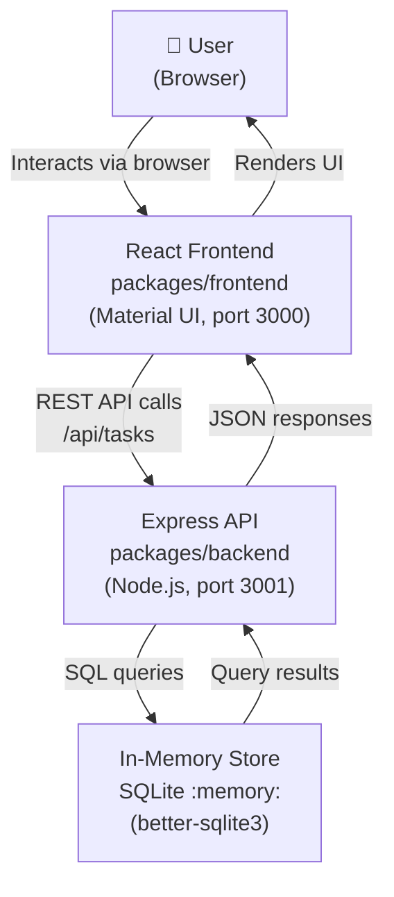
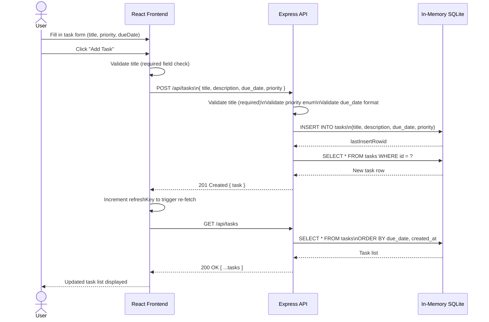

# Cloud Architecture Overview

This document describes the high-level architecture of the TODO App monorepo using system context and sequence diagrams.

---

## System Context Diagram

The following diagram shows the major components of the system and how they relate to each other.

---

## Sequence Diagram: User Creates a TODO

The following diagram shows the end-to-end flow when a user fills in the task form and submits a new task.

